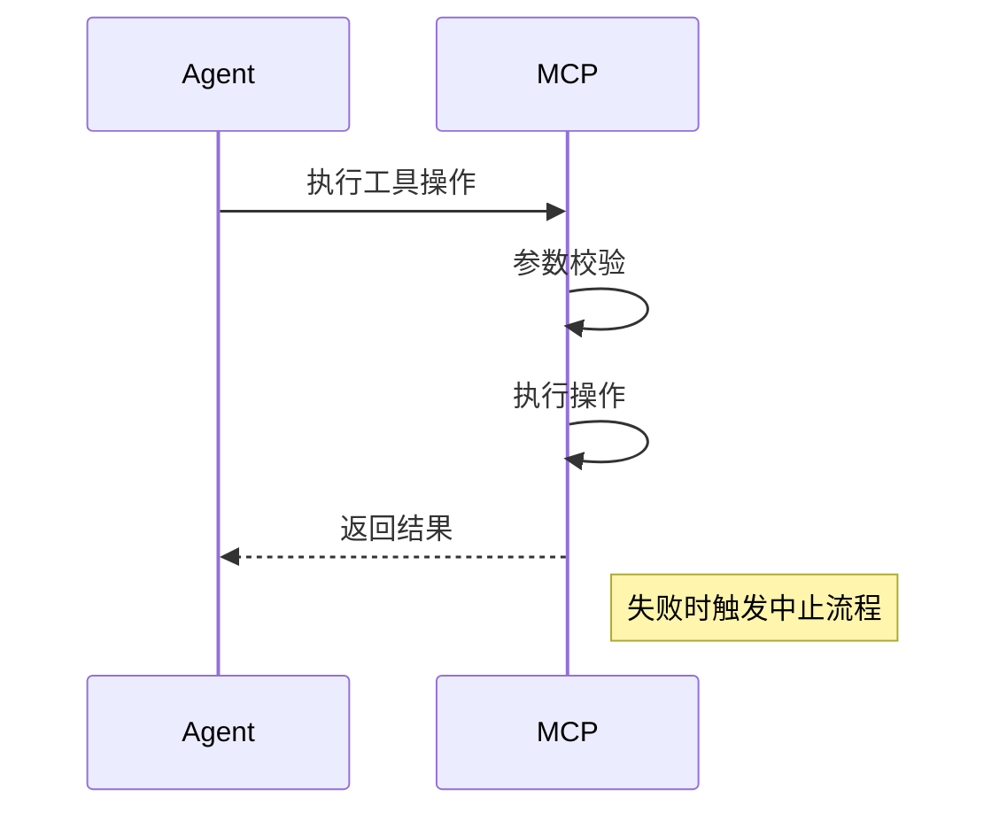

# 工具使用指南

## 核心功能概述
本系统提供多种工具支持软件开发任务，主要分为以下类别：

### 系统操作类
- `execute_command`: 执行CLI命令
- `read_file`: 文件内容读取
- `write_to_file`: 文件写入
- `replace_in_file`: 文件内容替换

### 代码分析类
- `search_files`: 正则搜索文件
- `list_files`: 目录列表
- `list_code_definition_names`: 代码定义列表

### 浏览器交互类
- `browser_action`: Puppeteer浏览器控制

### MCP服务类
- `use_mcp_tool`: 调用MCP服务器工具
- `access_mcp_resource`: 访问MCP资源
- `load_mcp_documentation`: 加载MCP文档

---


# MCP系统工具使用手册

## 核心工具分类
### 系统操作工具
| 工具名称 | 功能描述 | 示例 |
|---------|---------|------|
| `execute_command` | 执行CLI命令 | `<execute_command><command>npm install</command></execute_command>` |

### 文件处理工具
| 工具名称 | 功能描述 | 示例 |
|---------|---------|------|
| `write_to_file` | 文件写入 | `<write_to_file><path>config.json</path><content>{...}</content></write_to_file>` |
| `replace_in_file` | 精准替换 | `<replace_in_file><path>App.tsx</path><diff>...</diff></replace_in_file>` |

### 浏览器控制工具
| 工具名称 | 功能描述 | 示例 |
|---------|---------|------|
| `browser_action` | 网页操作 | `<browser_action><action>launch</action><url>http://localhost</url></browser_action>` |

## 工作流程指南
### 模式切换


---

## 工具详细说明

### 1. execute_command
```xml
<execute_command>
<command>具体命令</command>
<requires_approval>true/false</requires_approval>
</execute_command>
```

## 二、文件操作工具
### 1. write_to_file
```xml
<write_to_file>
<path>文件路径</path>
<content>完整文件内容</content>
</write_to_file>
```
​​适用场景​​：创建新文件/全量覆盖

### 2. replace_in_file
```xml
<replace_in_file>
<path>文件路径</path>
<diff>
<<<<<<< SEARCH
精确匹配内容
=======
替换内容
>>>>>>> REPLACE
</diff>
</replace_in_file>
```
​​规则​​：必须完全匹配行内容，多个修改按文件顺序排列

### 3. 浏览器操作
```xml
<browser_action>
<action>launch/click/type/scroll/close</action>
<url>访问地址</url>
<coordinate>X,Y坐标</coordinate>
<text>输入文本</text>
</browser_action>
```
​​工作流程​​：必须从launch开始，以close结束

# MCP服务集成
## 连接服务列表
### 1.TimeServer​​
get_current_time: 获取指定城市时间 <br>
get_current_weather: 获取天气信息

### 2.​​mcp-baostock-server-sse​​
股票数据查询（基础信息/历史数据）<br>
行业/财务指标查询

## 工具调用示例
```xml
<use_mcp_tool>
<server_name>TimeServer</server_name>
<tool_name>get_current_weather</tool_name>
<arguments>{"city": "北京"}</arguments>
</use_mcp_tool>
```

# 开发工作流
## 模式选择
​​ACT MODE​​：直接使用工具执行操作
​​PLAN MODE​​：通过<plan_mode_respond>制定方案
编辑策略
操作类型	推荐工具	适用场景
全量修改	write_to_file	创建新文件/架构调整
局部修改	replace_in_file	代码片段更新/配置调整
版本控制建议
使用search_files进行代码模式匹配
通过list_code_definition_names分析代码结构
修改后使用list_files确认文件状态

# MCP工具规则与错误处理机制

## 一、规则注意事项

### 1. 路径限制
- **强制约束**：所有文件操作必须基于根目录 `/Users/heyecheng/Program/llm/mcp/first_mcpserver`
- **路径示例**：
 ```xml
 <!-- 正确示例 -->
 <write_to_file>
   <path>./data/config.json</path>
 </write_to_file>

 <!-- 错误示例 -->
 <write_to_file>
   <path>/external/data/config.json</path>
 </write_to_file>
 ```
 
## 二、格式规范

### 1. 自动格式化
- 代码结构可能被调整（如缩进、换行）
- 修改后需人工验证格式一致性

### 2. 验证要求
- 关键操作必须人工检查替换结果
- 敏感操作示例：
  ```xml
  <replace_in_file>
    <path>config.yml</path>
    <diff>
      <<<<<<< SEARCH
      database:
        host: 127.0.0.1
      ======= 
      database:
        host: db.internal
      >>>>>>> REPLACE
    </diff>
  </replace_in_file>

## 三、安全限制

| 操作类型       | 参数要求                     | 示例                     |
|----------------|------------------------------|--------------------------|
| 文件删除       | `requires_approval="true"`   | `<delete_file requires_approval="true">` |
| 网络请求       | `requires_approval="true"`   | `<http_request requires_approval="true">` |

## 四、错误处理机制

### 1. 流程控制


---