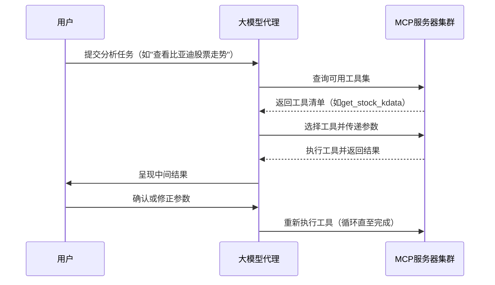

### 1. mcp 工具调用机制
#### 1.1 请求响应模型

```mermaid
sequenceDiagram
    participant User as 用户
    participant Agent as 大模型代理
    participant MCP as MCP服务器集群
    User->>Agent: 提交分析任务（如"查看比亚迪股票走势"）
    Agent->>MCP: 查询可用工具集
    MCP-->>Agent: 返回工具清单（如get_stock_kdata）
    Agent->>MCP: 选择工具并传递参数
    MCP-->>Agent: 执行工具并返回结果
    Agent->>User: 呈现中间结果
    User->>Agent: 确认或修正参数
    Agent->>MCP: 重新执行工具（循环直至完成）

```
