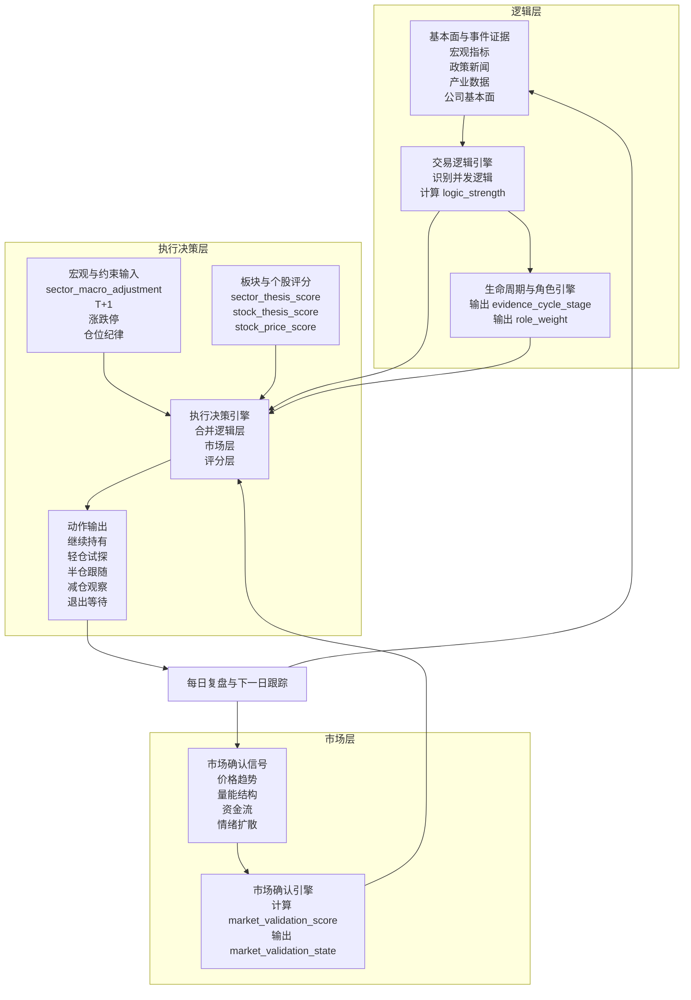

## 1. 文档目的

这份文档要解决的不是“系统有哪些模块”，而是更根本的三个问题：

1. 系统如何告诉用户，为什么这只股票现在值得持有。
2. 系统如何告诉用户，为什么现在应该减仓、观望或卖出。
3. 系统如何把“评分体系”和“交易逻辑”连成一个可执行的波段交易框架。

一句话概括：

> **评分体系负责描述当前状态，交易逻辑负责解释上涨或下跌的根因。两者一起，才构成波段交易的完整依据。**

更精确地说，本系统是一套 **三层判断系统**：

1. **逻辑层**：判断这条逻辑到底真不真。
2. **市场层**：判断市场有没有在交易这条逻辑。
3. **执行决策层**：判断现在该不该做、做多大、错了怎么退。

---

## 2. 核心结论

### 2.1 系统本质

这是一个**交易逻辑驱动的波段选股系统**。

它不是纯认知工具，也不是单纯的技术指标筛选器，而是一个围绕以下问题设计的决策系统：

- 当前市场在交易什么。
- 这个逻辑还在不在。
- 逻辑是在强化、减弱，还是已经切换。
- 哪些股票最能承接这个逻辑。
- 当前继续持有是否还有依据。

### 2.2 核心理念

本系统遵循四条原则：

1. **跟随，不预测**
   - 系统只基于当前可观测证据做判断，不给目标价，不猜顶部和底部。
2. **先看逻辑，再看表现**
   - 价格是结果，逻辑是原因。先回答“为什么涨”，再回答“还能不能拿”。
3. **做对的事，再把事做对**
   - 先找到对的板块和对的股票，再谈仓位、节奏和执行。
4. **看不懂就不硬做**
   - 当逻辑不清、证据冲突、评分失真时，系统应明确输出“暂不参与”或“仅观察”。

### 2.3 核心比喻

- **交易逻辑是灵魂**：决定股价背后的驱动力是什么。
- **评分体系是血肉**：衡量这个驱动力当前是否健康、是否被市场确认、是否值得继续持有。

缺少交易逻辑，评分会变成没有因果解释的表面数字。

缺少评分体系，交易逻辑会变成没有执行约束的空泛叙事。

---

## 3. 系统要解决的真实问题

系统面向 A 股波段交易，主要解决散户的四个问题：

1. **错过入场**
   - 看到行情时已经涨了一大段，但不知道背后的逻辑是否还能持续。
2. **被噪音洗出去**
   - 遇到回撤时，分不清是正常波动、逻辑走弱，还是逻辑已经切换。
3. **信息过载**
   - 新闻、研报、政策、资金、K 线太多，看不出真正主导行情的核心逻辑。
4. **持仓没有解释权**
   - 很多人能买入，但说不清为什么继续拿，也说不清为什么应该卖。

本系统的目标，不是替用户神奇预测未来，而是让每一笔持仓都能回答三句话：

1. **当前交易逻辑是什么。**
2. **这个逻辑还是否成立。**
3. **如果逻辑不再成立，系统会通过什么信号告诉我离开。**

---

## 4. 总体框架

### 4.1 决策闭环



### 4.2 三层判断总览

| 判断层 | 核心问题 | 允许输入 | 禁止输入 | 核心输出 |
|---|---|---|---|---|
| **逻辑层** | 这条逻辑是不是真的存在 | 研报、政策、产业数据、财报、订单、供需、竞争格局 | 价格涨跌、热度扩散、量价行为 | `logic_strength`、`role_weight`、`evidence_cycle_stage` |
| **市场层** | 市场有没有开始交易这条逻辑 | 价格结构、量能结构、资金承接、情绪扩散 | 政策真值、产业真值、未来收益回填 | `market_validation_score`、`market_validation_state` |
| **执行决策层** | 现在该不该做、做多大、怎么退 | 逻辑层输出、市场层输出、宏观加减分、持仓约束、A 股执行约束 | 任何直接用未来收益修正当日动作的写法 | `operation_suggestion`、`position_level`、`veto_reason` |

### 4.3 这套框架的关键点

1. **先识别逻辑，再评价状态**
   - 先回答“市场在交易什么”，再用评分衡量这个逻辑是否值得跟。
2. **逻辑证据与市场确认必须隔离**
   - 逻辑是否成立，不能由当前价格本身倒推出；市场表现只影响执行与确认，不反向污染逻辑真值。
   - 概念上就不该让市场价格来定义逻辑所处阶段，生命周期标签只能来自证据体系。
3. **不是一次性判断，而是持续跟踪**
   - 每天更新逻辑强度、评分变化和风险信号。
4. **评分变化不是孤立事件**
   - 评分显著变化，往往意味着逻辑的强化、衰退或切换。
5. **允许多逻辑并发存在**
   - 一段行情可能由主逻辑、辅助逻辑和反向逻辑同时驱动，系统必须描述它们的主次关系和相互抵消关系。
6. **卖出不是靠感觉，而是靠失效条件**
   - 当逻辑被证伪、主导逻辑切换、或关键维度塌陷时，系统必须给出清晰解释。

---

## 5. 决策主线：为什么持有，为什么卖出

### 5.1 为什么持有

用户继续持有一只股票，必须同时满足以下三个层面中的大部分条件：

1. **逻辑层面**
   - 当前主导交易逻辑仍然成立。
   - `logic_strength` 稳定或上升。
   - 没有出现足以证伪该逻辑的关键信号。

2. **评分层面**
   - 板块和个股的 `thesis_score` 没有明显塌陷。
   - 技术面和资金面没有出现连续恶化。
   - 个股仍然能承接所属板块的主逻辑。

3. **市场确认层面**
   - 价格行为没有持续背离逻辑方向。
   - 放量突破、趋势维持、资金承接等确认信号仍在。

因此，系统给出“继续持有”的解释模板应是：

> 当前主导逻辑仍成立，逻辑强度未下降，板块和个股评分保持健康，市场尚未出现明确证伪信号，因此继续持有。

### 5.2 为什么卖出

用户卖出，不是因为“涨不动了”这么简单，而是因为以下任一类失效条件被触发：

1. **逻辑失效**
   - 旧逻辑被证伪。
   - 逻辑关键证据链断裂。
   - 新逻辑已接近或替代旧逻辑。

2. **评分塌陷**
   - 核心维度出现明显下滑，如逻辑面、资金面、技术面同步走弱。
   - `sector_thesis_score` 或 `stock_thesis_score` 相对历史显著恶化。

3. **市场给出失效确认**
   - 价格连续背离逻辑方向。
   - 关键支撑失守且量能结构恶化。
   - 板块或个股进入风险排查清单，且风险信号持续强化。

系统给出“卖出/减仓”的解释模板应是：

> 不是因为短期波动，而是因为当前主导逻辑已被削弱或切换，同时关键评分维度显著下滑，市场也给出失效确认，因此应减仓或退出。

### 5.3 三类典型动作

| 动作 | 适用条件 | 系统解释 |
|---|---|---|
| **继续持有** | 逻辑未坏，评分健康，价格未证伪 | 趋势仍在，逻辑仍成立 |
| **减仓/观察** | 逻辑未完全失效，但评分开始恶化或出现背离 | 先收缩风险，等待确认 |
| **卖出/切换** | 逻辑被证伪或新逻辑接管 | 原持仓理由已不成立 |

---

## 6. 评分体系与交易逻辑如何联动

### 6.1 联动关系

评分体系和交易逻辑不是两套并列系统，而是一套因果闭环：

1. **交易逻辑回答“为什么涨/跌”**
2. **评分体系回答“当前这个逻辑处于什么状态”**
3. **变化检测回答“状态变化是否意味着逻辑切换或拐点出现”**

进一步拆开后，系统内部其实有三层判定：

1. **逻辑真值层**
   - 只看证据链，不看价格涨跌。
   - 用来判断某条逻辑“是否成立”。
2. **市场确认层**
   - 只看价格、量能、资金、扩散程度。
   - 用来判断这条逻辑“是否已经被市场交易”。
3. **执行决策层**
   - 将逻辑真值、市场确认、宏观加减分和持仓约束合并。
   - 用来判断“现在该不该做、该轻仓还是重仓”。

这三层不是展示层概念，而是实现层边界。任何字段都必须先回答：

1. 它属于哪一层。
2. 它可以引用哪些输入。
3. 它会影响哪一层的输出。
4. 它是否越权污染了别的层。

这三层必须严格隔离。核心原则是：

- `logic_strength` 只能来自逻辑证据，不能来自价格表现。
- `market_validation_score` 只能来自市场表现，不能反向修改 `logic_strength`。
- `evidence_cycle_stage` 只能来自研究证据和可信消息源，不能由涨跌幅、量价扩散、热度扩散来定义。
- `market_validation_state` 只描述市场当前是否在交易这条逻辑，不能回写生命周期标签。
- 市场可以否决交易动作，但不能直接证明逻辑为真。

为了避免后续实现混层，初始字段映射如下：

| 字段 | 所属层 | 主要用途 |
|---|---|---|
| `logic_strength` | 逻辑层 | 判断逻辑强弱 |
| `role_weight` | 逻辑层 | 判断逻辑主导份额 |
| `evidence_cycle_stage` | 逻辑层 | 判断生命周期位置 |
| `market_validation_score` | 市场层 | 判断市场确认强弱 |
| `market_validation_state` | 市场层 | 判断市场交易状态 |
| `stock_recommend_score` | 执行决策层 | 排序和展示 |
| `operation_suggestion` | 执行决策层 | 动作建议 |
| `position_level` | 执行决策层 | 仓位级别 |
| `veto_reason` | 执行决策层 | 否决原因解释 |

### 6.2 联动规则

#### 情况 A：逻辑增强 + 评分增强

- 含义：主升段延续或强化。
- 解释：逻辑被更多证据确认，市场也同步认可。
- 动作：继续持有，必要时只在回踩确认后加仓。

#### 情况 B：逻辑稳定 + 评分短期回落

- 含义：可能只是震荡，不一定是逻辑坏了。
- 解释：先看是技术回撤、资金换手，还是逻辑证据本身变差。
- 动作：不急于卖，进入观察。

#### 情况 C：逻辑减弱 + 核心评分下滑

- 含义：趋势可能进入后半段。
- 解释：这通常是“持仓理由变弱”，不是简单波动。
- 动作：减仓，收紧失效条件。

#### 情况 D：逻辑切换 + 评分重排

- 含义：原交易理由已经改变。
- 解释：需要重新回答“现在市场在交易什么”。
- 动作：退出旧持仓或切换到更契合新逻辑的标的。

### 6.3 变化检测的核心判断

系统每天都要回答一个问题：

> 今天的分数变化，究竟只是噪音，还是意味着逻辑层已经发生了变化？

因此需要把“分数变化”分成三类：

| 变化类型 | 典型表现 | 解释 |
|---|---|---|
| **噪音变化** | 单日波动，次日恢复 | 不改变主逻辑 |
| **状态变化** | 连续数日缓慢恶化或改善 | 逻辑强弱在变化 |
| **逻辑变化** | 主导逻辑切换，关键证据反转 | 原持仓逻辑失效 |

### 6.4 多逻辑并发与主次切换

一段行情允许多个逻辑同时存在，且它们的作用方向可能不同：

- **主逻辑**：当前最主要的推动力，决定板块叙事中心。
- **辅助逻辑**：不能单独驱动整段行情，但能增强主逻辑的持续性或斜率。
- **反向逻辑**：对行情形成压制，解释为什么“逻辑是对的，但市场走得慢”。

每条活跃逻辑都必须具备以下属性：

- `direction`: `positive` / `negative`
- `role`: `primary` / `secondary` / `headwind`
- `role_weight`: 当前角色权重份额
- `logic_strength`: 证据强度
- `market_validation_score`: 市场确认度

板块层不再假设只有一条逻辑，而是同时维护一个活跃逻辑集合 `active_logics`。

这里必须强调一个约束：

> `sector_logic_net_score` 的任务是衡量“净方向”，不是衡量“逻辑条数”。

因此本系统选用 **纯净分方案**，不做额外共振加分。凡是会因为“同方向逻辑数量增加”而自动抬高净分的写法，一律禁止。

板块净逻辑推力定义为：

```text
positive_core_score = Σ(positive_logic_strength × positive_role_weight)
negative_core_score = Σ(negative_logic_strength × negative_role_weight)
sector_logic_net_score = positive_core_score - negative_core_score
```

其中必须满足 4 条硬约束：

1. 正向逻辑与反向逻辑分别归一，不能混在一起分配权重。
2. 若当日存在正向逻辑，则所有正向逻辑 `role_weight` 之和必须等于 1。
3. 若当日存在反向逻辑，则所有反向逻辑 `role_weight` 之和必须等于 1。
4. 同方向新增一条辅助逻辑后，若各逻辑 `logic_strength` 不变，则净分只能因权重重分配而变化，不能因“逻辑条数增加”自动上升。

这意味着：

- `sector_logic_net_score` 在不同时点、不同板块之间才可比。
- “逻辑增强”和“逻辑拆得更细”可以被区分。
- 回测中看到的净推力变化，更接近真实叙事变化，而不是标注方式变化。

`role_weight` 也不能靠拍脑袋给。它不是逻辑强度，也不是价格确认度，而是 **这条逻辑在当前叙事里占多大主导份额**。

为了避免和 `logic_strength` 重复计分，`role_weight` 只由证据层的 4 个维度生成原始分：

1. **因果中心性**
   - 这条逻辑是否解释了板块当前最核心的盈利驱动或定价驱动。
2. **产业覆盖度**
   - 这条逻辑影响的是单点公司，还是产业链大部分关键环节。
3. **持续性**
   - 这条逻辑是一次性冲击，还是能持续若干周或若干月的主线。
4. **不可替代性**
   - 如果去掉这条逻辑，当前板块叙事是否会明显失真。

这里不能使用全市场统一固定权重，否则会系统性低估“窄但真”的快逻辑。

因此 `role_weight` 不采用单一固定公式，而采用 **逻辑族模板公式**。先按逻辑族判断，再生成 `role_raw_score`：

```text
role_eligibility_score = gate(causal_centrality, irreplaceability, evidence_quality, logic_family)
role_raw_score = template(logic_family, causal_centrality, coverage_breadth, persistence, irreplaceability)
role_weight(direction) = role_raw_score / Σ(role_raw_score within same direction)
```

其中：

1. `role_eligibility_score` 用于先判断一条逻辑有没有资格进入主导候选。
2. `role_raw_score` 用于在同方向候选集合内重新分配主导份额。
3. 快逻辑允许“高中心性、低覆盖度”进入主导候选；慢逻辑不允许靠单点催化长期占据高主导份额。

逻辑族模板初始版建议如下：

```text
fast_role_raw_score = 0.45 * causal_centrality
                    + 0.15 * coverage_breadth
                    + 0.10 * persistence
                    + 0.30 * irreplaceability

mid_role_raw_score = 0.35 * causal_centrality
                   + 0.20 * coverage_breadth
                   + 0.20 * persistence
                   + 0.25 * irreplaceability

slow_role_raw_score = 0.30 * causal_centrality
                    + 0.30 * coverage_breadth
                    + 0.25 * persistence
                    + 0.15 * irreplaceability
```

补充约束：
1. 快逻辑若 `causal_centrality >= 4` 且 `irreplaceability >= 4`，即使 `coverage_breadth <= 2`，仍可进入主逻辑候选。
2. 慢逻辑若 `persistence < 3`，即使短期很强， 也不能直接给高 `role_weight`。
3. `coverage_breadth`的低分， 对快逻辑只表示“ 逻辑窄”， 不自动表示“ 逻辑弱”。

中逻辑默认模板如下： 
```text
mid_role_raw_score = 0.35 * causal_centrality
                   + 0.20 * coverage_breadth
                   + 0.20 * persistence
                   + 0.25 * irreplaceability
```

补充规则：
1. `role` 是离散标签， 回答“ 它是谁”。
2. `role_weight` 是连续份额， 回答“ 它占多大”。
3. `logic_strength` 回答“ 它本身强不强”。
4. 三者不能互相代替， 也不能混算。
5. `role_eligibility_score` 负责“ 能不能进候选`role_weight` 负责“ 进来以后占多大份额”。

如果只有一条正向逻辑， 则该正向逻辑 `role_weight = 1`。

如果同时存在主逻辑和辅助逻辑， 建议先以 `role`生成先验份额区间， 再由上述 4 个证据维度微调后归一： 
- `primary`: 先验区间 0.50 到 0.80 
- `secondary`: 先验区间 0.20 到 0.50 
- `headwind`: 在反向集合内单独归一， 不与正向集合竞争权重

##### 6.4.1 `role_weight` 字段与判定口径
标注顺序必须固定， 不能跳步：
1. 先确认 `direction`。
2. 再确认 `role`。
3. 再对 4 个证据维度逐项打分。
4. 每个维度至少绑定 2 条可回溯证据， 其中至少 1 条来自高可信度或中高可信度来源。
5. 生成 `role_raw_score`后， 再在同方向内部归一为 `role_weight`。
6. 若逻辑族为快逻辑， 必须先检查“ 高中心性 + 高不可替代性” 的例外通道， 避免被覆盖度低分误杀。

所有维度统一采用 0 到 5 分制： 
- `0`: 基本不成立 
- `1`: 极弱， 只是边缘补充 
- `2`: 偏弱， 有一定解释力但明显不是核心 
- `3`: 中等， 已具备稳定解释力 
- `4`: 强， 明显进入主导候选 
- `5`: 极强， 当前叙事的核心骨架
  
##### `causal_centrality`

| 分值 | 直接标注标准 |
| --- | --- |
| `0` | 该逻辑与板块当前上涨或下跌的核心因果几乎无关， 更多像陪衬叙事 |
| `1` | 能解释局部异动， 但拿掉它后， 主叙事几乎不受影响 |
| `2` | 能解释部分龙头或部分环节表现， 但不是主要盈利或估值驱动力 |
| `3` | 已能解释板块中一批核心标的的定价变化， 是主叙事的重要组成部分 |
| `4` | 已成为板块当前最主要的盈利驱动、 估值驱动或政策驱动之一 |
| `5` | 若拿掉这条逻辑， 当前整段行情的主要因果链将明显断裂 | 

##### `coverage_breadth`

| 分值 | 直接标注标准 |
| --- | --- |
| `0` | 只影响单一公司或极少数题材票 |
| `1` | 只影响极窄子领域， 无法扩展到板块主干 |
| `2` | 可影响板块中的一个小分支， 但产业链传导有限 |
| `3` | 已覆盖多个关键环节， 龙头和重要配套环节都能找到受益证据 |
| `4` | 产业链大部分关键环节均出现可验证影响， 板块扩散具备基础 |
| `5` | 逻辑已成为整个板块或跨板块的大范围驱动， 受益链条清晰且连续 | 

##### `persistence`

| 分值 | 直接标注标准 |
| --- | --- |
| `0` | 一次性消息冲击， 当日或数日后即失去跟踪价值 |
| `1` | 预计只能持续极短时间， 缺少继续验证抓手 |
| `2` | 可能持续数日到一两周， 但缺少中期延展证据 |
| `3` | 已具备周级别持续性， 后续仍有可跟踪验证节点 |
| `4` | 已具备月级别持续性， 证据链可沿时间持续兑现 |
| `5` | 具备季度级或更长持续性， 且核心驱动短期难以逆转 | 

##### `irreplaceability`

| 分值 | 直接标注标准 |
| --- | --- |
| `0` | 板块叙事完全可以被其他逻辑替代， 该逻辑可有可无 |
| `1` | 只是锦上添花， 去掉后叙事主体仍基本成立 |
| `2` | 去掉后会损失一部分解释力， 但仍有其他逻辑可接管 |
| `3` | 去掉后主叙事明显变弱， 但仍存在替代解释 |
| `4` | 去掉后当前主叙事会出现明显空洞， 替代逻辑不足 |
| `5` | 去掉后当前行情几乎无法被合理解释， 是不可替代的核心支柱 | 

#### 6.4.2 标注产物与复核要求
每次 `role_weight`标注都必须输出：
1. 四个维度的原始分
2. 每个维度对应的证据摘要
3. 标注日期
4. 标注人或标注模块
5. `role_weight_confidence`

复核规则：
1. 主逻辑与新上升辅助逻辑发生接近时， 必须人工复核。
2. 若同一逻辑在 5 个交易日内 `role_weight`
大幅波动， 但证据无新增， 视为标注不稳定。
3. 若不同标注人对同一逻辑的四维分差异过大， 必须回看口径定义， 而不是直接平均。

主次切换不是离散跳变， 而是动态再加权：
1. 当旧主逻辑的因果中心性、 覆盖度或持续性下降时`role_weight`
逐步下调。
2. 当辅助逻辑的证据主导份额持续上升时`role_weight`
逐步上调。
3. 当反向逻辑持续增强时， 即使主逻辑未死， 也要降低执行级别。
4. 市场确认可以帮助判断是否进入执行切换， 但不能直接定义 `role_weight`。
这使系统可以表达真实市场状态： 

- 主逻辑仍在， 但辅助逻辑接棒。 
- 主逻辑未死， 但反向逻辑正在压制涨幅。 
- 正向主线未变， 但正向内部的主导份额正在迁移。

### 7. 三层评分体系
#### 7.1 总览
系统采用三层评分体系：
1. **宏观层** ：决定当前市场大环境和板块风格是否匹配。
2. **板块层** ：决定哪个方向值得做， 哪个方向只是表面热闹。
3. **个股层** ：决定具体拿哪只股票承接这条逻辑。

#### 7.2 宏观层
宏观层的任务不是预测指数点位， 而是回答两个问题：
1. 当前大环境是否支持更激进的交易。
2. 当前宏观环境更偏利好哪些板块， 压制哪些板块。

#### 7.2.1 宏观层五个维度 
| 维度 | 关键指标 | 作用 |
| --- | --- | --- |
| **流动性环境** | M1 - M2 剪刀差、 Shibor 期限结构、 社融增速、 Shibor - Hibor 利差 | 判断市场是否具备估值扩张基础 |
| **经济周期位置** | PMI 领先指数、 库存周期、 分行业景气度 | 判断增长动能和板块景气位置 |
| **通胀与成本** | PPI - CPI 剪刀差、 PPI 传导、 PMI 价格指数 | 判断利润压力与成本拐点 |
| **政策方向** | 高层定调、 部委政策、 产业政策密度、 融资成本 | 判断政策支持或压制方向 |
| **全球联动** | Fed Rate、 10 Y Treasury、 ISM PMI、 非农、 关税风险、 Polymarket | 判断外部流动性和风险偏好 |

#### 7.2.2 宏观层输出

- `macro_thesis_score`
- `macro_state`
- `cycle_position`
- `macro_radar`
- `leading_signals`
- `trend_analysis`
- `sector_macro_adjustment`

#### 7.2.3 宏观层定位

宏观层不直接决定买哪只股票，但会决定：

- 系统整体是偏进攻还是偏谨慎。
- 哪些板块应得到加分，哪些板块应被打折。
- 是否需要提前警惕风格切换。

宏观层在本系统中明确定位为：

- **加减分器**，不是总闸门。
- 宏观层可以降低或提升板块优先级，但不能单独把所有机会一票否决。

因此执行规则是：

1. `macro_thesis_score` 用于描述大环境，不直接决定可不可以交易。
2. `sector_macro_adjustment` 作为板块级修正项参与最终排序。
3. 即使宏观环境一般，若某个板块主逻辑极强、市场确认也足够，仍可进入推荐，但仓位级别应更保守。
4. 即使宏观环境良好，若板块逻辑本身不成立，也不能因为宏观加分而被推荐。

### 7.3 板块层

板块层是整个系统的核心，因为大多数波段机会首先发生在板块，而不是个股。

#### 7.3.1 板块层回答的问题

1. 当前最值得交易的板块是哪几个。
2. 这些板块背后有哪些并发逻辑，分别是谁在主导、谁在辅助、谁在压制。
3. 各条逻辑是在增强、走平，还是衰退。
4. 板块当前的市场表现是否已经确认这些逻辑。
5. 如果逻辑主次关系变化，当前是否意味着进入新的交易阶段。

#### 7.3.2 板块五维评分

| 维度 | 含义 |
|---|---|
| **逻辑面** | 当前主导逻辑是否成立，强度如何 |
| **基本面** | 行业景气、盈利、估值、供需等是否支持 |
| **技术面** | 趋势、突破、支撑阻力、量价关系 |
| **资金面** | 资金净流入、北向变化、主力承接 |
| **情绪面** | 新闻热度、社媒讨论度、情绪强弱 |

#### 7.3.3 板块层输出

- `sector_radar`
- `sector_thesis_score`
- `sector_price_score`
- `sector_logic_strength`
- `sector_logic_net_score`
- `sector_evidence_cycle_stage`
- `sector_market_validation_state`
- `sector_dominant_logic_id`
- `sector_active_logics`
- `sector_logic_change_detected`
- `issue_queue`

### 7.4 个股层

个股层的任务不是脱离板块单独选股，而是在已识别的板块主逻辑内，找出承接能力最强的股票。

#### 7.4.1 个股池

- 每日成交额 top200
- 用户自选股票

#### 7.4.2 个股五维评分

| 维度 | 含义 |
|---|---|
| **逻辑面** | 个股与所属板块主逻辑是否一致，是否有自身催化 |
| **基本面** | 财务质量、成长性、估值、护城河、管理质量 |
| **技术面** | 趋势与结构是否适合波段介入 |
| **资金面** | 主力资金、北向、融资融券、大单流向 |
| **情绪面** | 新闻与投资者情绪是否支持 |

#### 7.4.3 个股层输出

- `stock_radar`
- `stock_thesis_score`
- `stock_price_score`
- `stock_recommend_score`
- `operation_suggestion`

### 7.5 综合决策层

综合推荐不是简单平均，而是按决策顺序加权：

```text
最终推荐 = 逻辑真值 + 市场确认 + 宏观加减分 + 个股承接能力
```

最终推荐必须遵守两个原则：

1. **市场确认影响执行，不影响逻辑真值**。
2. **宏观层只做加减分，不做总闸门**。
3. **`sector_logic_net_score` 必须保持可比性，不允许因逻辑数量变化自动抬升**。

执行决策层必须显式回答 4 个问题：

1. 当前是否允许参与。
2. 如果允许，建议仓位级别是多少。
3. 如果不允许，否决原因是什么。
4. 后续需要等什么条件，才能从观察转为执行。

因此执行决策层至少输出以下字段：

- `operation_suggestion`
- `position_level = no_trade / watch / probe_small / follow_half / hold / reduce / exit`
- `decision_confidence`
- `veto_reason`
- `revalidation_trigger`

这里也不能使用全系统统一固定综合权重，否则前面已经区分出的快逻辑、中逻辑、慢逻辑，会在执行层被重新压回同一种行为模式。

因此执行决策层采用 **逻辑族专属执行模板**，而不是全局唯一公式。

执行层先输出两个中间判断：

1. `entry_readiness_score`
   - 判断当前能不能进。
2. `holding_quality_score`
   - 判断进来后值不值得继续拿。

最终 `stock_recommend_score` 是展示层排序结果，不再承担全部执行语义。

逻辑族专属执行模板初始版建议如下：

```text
fast_entry_readiness_score = 0.20 * stock_thesis_score
                           + 0.15 * sector_logic_net_score
                           + 0.25 * stock_price_score
                           + 0.25 * sector_price_score
                           + 0.15 * sector_macro_adjustment

mid_entry_readiness_score = 0.30 * stock_thesis_score
                          + 0.25 * sector_logic_net_score
                          + 0.20 * stock_price_score
                          + 0.15 * sector_price_score
                          + 0.10 * sector_macro_adjustment

slow_entry_readiness_score = 0.35 * stock_thesis_score
                           + 0.30 * sector_logic_net_score
                           + 0.10 * stock_price_score
                           + 0.10 * sector_price_score
                           + 0.15 * sector_macro_adjustment
```

解释：

1. 快逻辑更依赖市场确认，不依赖长周期证据充分展开。
2. 中逻辑相对均衡。
3. 慢逻辑更依赖逻辑真值和生命周期位置，不应被短期价格确认绑架。

中逻辑默认展示公式如下：

```text
mid_stock_recommend_score = stock_thesis_score * 0.30
                          + sector_logic_net_score * 0.25
                          + stock_price_score * 0.20
                          + sector_price_score * 0.15
                          + sector_macro_adjustment * 0.10
```

补充约束：

1. 若 `sector_logic_net_score` 很强但 `stock_price_score` 很弱，系统应输出“左侧观察/轻仓试探”，而不是高置信推荐。
2. 若 `stock_price_score` 很强但 `sector_logic_net_score` 很弱，系统应输出“价格先行，但逻辑不足”，默认不进入重点关注。
3. `sector_macro_adjustment` 取值范围应受限，例如 `-0.10 ~ +0.10`，避免宏观层覆盖板块和个股的主判断。
4. 快逻辑的 `entry_readiness_score` 可高于 `holding_quality_score`，因为它更强调确认时点。
5. 慢逻辑的 `holding_quality_score` 应高于短期价格确认权重，因为它更强调主线持续性。

执行否决规则初始版：

1. **逻辑层否决**
   - `logic_strength` 跌破模板下限，或关键证据链断裂。
2. **市场层否决**
   - `market_validation_state = invalidated`，且背离持续超过模板窗口。
3. **约束层否决**
   - T+1、涨跌停、停牌、单票仓位上限等使建议动作不可执行。

若任一否决条件触发，系统必须给出人话解释，而不是只给低分。

分层展示：

| 层级 | 条件 |
|---|---|
| **重点关注** | 推荐分数高，且无明显短板 |
| **观察名单** | 逻辑有吸引力，但尚未完全确认 |
| **其余** | 当前不应投入主要注意力 |

---

## 8. 交易逻辑完整生命周期

### 8.1 为什么必须有生命周期

一条逻辑不是一句标签。它有出生、强化、转弱、切换、死亡的过程。

如果没有生命周期管理，系统就会出现两个问题：

1. 只能告诉用户“现在很强”，但说不清“还能强多久”。
2. 只能在行情走出来后回头解释，无法在切换前后提供有效提醒。

### 8.2 生命周期结构


### 8.3 七个阶段

#### 阶段 1：发现逻辑

- 输入：新闻、政策、研报、产业数据、供应链、公司基本面、宏观因子。
- 目标：识别板块当前最可能的主导叙事。
- 输出：候选 `TradingLogic`。

说明：本阶段禁止使用价格涨跌和资金流向作为逻辑成立证据，避免“用价格解释价格”。

#### 阶段 2：建立证据链

- 按逻辑类型自动生成评估维度。
- 为每条逻辑建立可验证的证据节点。
- 至少满足一个高可信度源加一个中可信度源交叉验证。

#### 阶段 3：追踪强度

- 每日更新 `logic_strength`。
- 判断 `logic_strength_trend` 是 increasing、stable 还是 declining。
- 记录次要逻辑与主逻辑的差距变化。

这里的 `logic_strength` 必须是 **evidence-based score**，只由证据链节点打分得出，不允许混入价格、成交量、资金流、热度扩散。

#### 阶段 4：判断周期位置

每条逻辑不仅要判断强弱，还要判断它所处的证据阶段。系统不追求给出精确天数预测，而是输出一个阶段概率分布：

- `evidence_cycle_stage = early / mid / late / exhaustion`
- `evidence_cycle_stage_confidence`

这里必须先钉死概念边界：

> 生命周期阶段描述的是“逻辑在基本面、产业、政策、盈利传导上走到哪一步”，不是“市场已经涨了多少”。

因此 `evidence_cycle_stage` 禁止使用以下信息作为定义依据：

1. 股价涨跌幅
2. 量价扩散
3. 题材热度扩散
4. 资金追逐强弱

`evidence_cycle_stage` 只允许通过四类研究证据信号联合判定：

1. **证据渗透率**
   - 核心证据是否刚出现，还是已经连续验证多期。
2. **产业扩散度**
   - 是少数环节开始受益，还是订单、产能、渗透率、客户导入已经扩展到更完整的产业链。
3. **研究共识建模程度**
   - 逻辑是否仍在研究发现阶段，还是研报、公司指引、行业数据已经形成较稳定的盈利路径共识。
4. **反向约束强度**
   - 供给释放、监管压制、估值拥挤、盈利兑现压力是否已增强。

系统输出的是“证据阶段判断”，不是“精确剩余天数”。例如：

- 早期：核心证据刚出现，产业扩散有限，研究共识仍在建立。
- 中期：证据连续验证，产业扩散加深，研究共识逐步稳定。
- 后期：证据仍在，但新增边际下降，反向约束开始抬头。
- 衰竭：新证据显著减少，反向约束占优，逻辑边际驱动基本衰减。

#### 阶段 5：监控市场确认

市场确认层单独运行，不反向修改逻辑真值。其任务是回答：

- 这条逻辑是否已被市场交易。
- 现在属于左侧、右侧还是拥挤后期。
- 当前是否适合执行，而不是仅仅“逻辑正确”。

核心输出：

- `market_validation_score`
- `market_validation_state = unrecognized / validating / confirmed / crowded / invalidated`
- `execution_mode`

市场确认信号来源包括：

1. 价格结构
2. 量能结构
3. 资金承接
4. 情绪扩散

说明：市场确认层可以否决仓位动作，但不能把一条逻辑从“真”改成“假”。
它也不能定义 `evidence_cycle_stage`。市场看到的是交易状态，不是生命周期真值。

#### 阶段 6：确认主次切换

拐点信号来源分三类：

1. **市场信号**
   - 量价异动、趋势破坏、成交结构变化。
2. **宏观信号**
   - 领先指标、政策转向、流动性收紧或放松。
3. **板块内在信号**
   - 订单、产能、价格、供需、竞争格局、龙头业绩变化。

以下任一情况触发重点确认：

- 当前 dominant `logic_strength < 0.3`
- 新逻辑 `logic_strength > dominant × 0.8`
- 当前 `role_weight` 出现连续重分配
- 当前市场确认连续 3 日与主逻辑方向背离

输出 `LogicFlipEvent`，并说明：

- 旧逻辑为什么衰退
- 新逻辑为什么上位
- 当前是左侧预警还是右侧确认
- 当前动作建议是什么

#### 阶段 7：输出动作

输出不止是“涨/跌判断”，而要直接服务持仓：

- 继续持有
- 轻仓试探
- 半仓跟随
- 减仓观察
- 退出等待下一逻辑

动作映射必须同时满足以下输入：

1. `logic_strength`
2. `evidence_cycle_stage`
3. `market_validation_state`
4. `sector_macro_adjustment`

---

## 9. 逻辑类型与风险模板

系统预定义以下逻辑类型，用于统一识别、建模和回测：

| 逻辑类型 | 核心含义 | 典型持续时间 |
|---|---|---|
| **产业趋势** | 产业长期扩张或收缩 | 数月至数年 |
| **政策驱动** | 政策直接改变预期和定价 | 数周至数月 |
| **供需周期** | 供需错配与周期轮动 | 数月至季度 |
| **流动性** | 资金环境变化推动估值重定价 | 数周至数月 |
| **事件驱动** | 突发事件短期改变风险偏好 | 数日至 2 周 |
| **估值重构** | 市场重新选择定价锚 | 数周至数月 |
| **成本反转** | 原材料或成本曲线发生反转 | 数月至季度 |
| **技术革命** | 技术突破改变产业格局 | 数月至数年 |
| **竞争格局变化** | 龙头、新进入者、并购等改变格局 | 数月 |
| **制度变革** | 注册制、交易规则、监管制度等变化 | 数周至数月 |

每种逻辑类型都必须绑定一套风险模板。风险模板的目的不是记录风险清单，而是服务于三件事：

1. 发现逻辑正在变弱。
2. 将逻辑加入排查清单。
3. 触发逻辑切换检测。

此外，每种逻辑类型还必须绑定自己的**周期模板**和**阈值模板**，不能全市场统一：

| 逻辑族 | 典型节奏 | 推荐观察窗口 | 阈值特征 |
|---|---|---|---|
| **快逻辑** | 事件驱动、制度变革 | 1-5 日 | 阈值更敏感，重速度 |
| **中逻辑** | 政策驱动、流动性、估值重构 | 5-20 日 | 阈值平衡速度与稳定性 |
| **慢逻辑** | 产业趋势、技术革命、供需周期 | 20-60 日 | 阈值更钝化，重持续性 |

系统执行时应先按逻辑类型归类，再调用对应模板。不能用同一套阈值去判断所有逻辑。

### 9.1 模板治理与上线/下线门槛

模板不是一旦校准出来就永久有效，而必须有治理状态。

每张模板卡都必须有一个生命周期状态：

- `candidate`
- `shadow_live`
- `live`
- `degraded`
- `retired`

其中：

1. `candidate` 只用于研究和离线校准。
2. `shadow_live` 允许线上影子运行，但不能直接驱动高仓位动作。
3. `live` 才允许驱动正式执行模板。

#### 9.1.1 上线门槛

模板只有同时满足以下条件，才允许从 `candidate` 进入 `shadow_live`，再进入 `live`：

`candidate -> shadow_live` 门槛：

1. 至少连续 1 个 walk-forward 窗口样本外有效。
2. 基础样本量达标。
3. 没有明显的标签污染或结构性失真。

`shadow_live -> live` 门槛：

1. 至少连续 2 个 walk-forward 窗口样本外有效。
2. 样本量达到最低要求：
   - 快逻辑事件样本不少于 30
   - 中逻辑事件样本不少于 20
   - 慢逻辑事件样本不少于 12，且不能只满足事件数要求
3. 动作建议相对最强基线至少满足以下之一：
   - 收益风险比改善显著，或
   - 最大回撤显著下降且收益不明显恶化。
4. `evidence_cycle_stage` 的阶段区分仍然成立，不能失去顺序性。
5. 主次切换误报成本未超过模板容忍阈值。

慢逻辑额外门槛：

1. 至少覆盖 2 个不同市场风格期。
2. 至少覆盖 2 个不同宏观流动性阶段。
3. 至少覆盖 2 个不同产业兑现阶段。
4. 样本外表现不能主要由 1 到 2 个极端样本贡献。

也就是说，慢逻辑上线不能只看“事件个数”，还要看“周期覆盖数”和“风格覆盖数”。

#### 9.1.2 降级门槛

若出现以下任一情况，模板从 `live` 降为 `degraded`：

1. 连续 2 个滚动窗口样本外表现弱于最强基线。
2. `late` 与 `mid` 的风险收益分布不再可区分。
3. 主次切换误报率连续 2 个窗口超阈值。
4. `role_weight` 标注一致性显著下降。
5. 宏观或制度环境变化导致模板大量失效，但原因尚未完全厘清。

降级后的模板可以继续作为参考，但不能直接驱动高仓位动作；必要时可回落到 `shadow_live` 状态。

#### 9.1.3 退役门槛

若出现以下任一情况，模板必须进入 `retired`：

1. 连续 3 个滚动窗口样本外失效。
2. 核心因果假设被制度变化、产业变化或市场结构变化推翻。
3. 样本外误报成本高于收益贡献，且修补后仍无法恢复。
4. 标签体系被证明存在结构性污染，例如生命周期标签混入市场价格定义。

退役模板不得继续参与线上动作决策，只能保留用于复盘。

#### 9.1.4 模板治理输出

每张模板卡每轮复核后都必须输出：

- `template_status`
- `last_review_date`
- `review_window`
- `go_live_reason` 或 `degrade_reason` 或 `retire_reason`
- `next_review_action`
- `coverage_summary`

---

## 10. 评分变化如何映射为交易动作

这是本系统最关键的执行层规则。

### 10.1 变化解释矩阵

| 观察到的变化 | 更可能意味着什么 | 建议动作 |
|---|---|---|
| `logic_strength` 上升，板块/个股评分同步改善 | 逻辑强化 | 继续持有，等待回踩确认加仓 |
| `logic_strength` 稳定，但技术/资金短期走弱 | 震荡或洗盘 | 观察，不急于否定逻辑 |
| `logic_strength` 下降，逻辑面与资金面同步恶化 | 趋势后半段或逻辑衰退 | 减仓，缩短持有周期 |
| 次要逻辑快速抬头，主逻辑优势缩小 | 可能出现切换 | 重点跟踪，不再重仓旧逻辑 |
| 宏观层变差，板块仍强 | 风格压制将增强 | 保留强股，但降低容错 |
| 逻辑被证伪，价格也失效 | 原持仓理由消失 | 卖出或移出重点池 |

### 10.2 动作建议的可执行规则

为避免“解释像结论，执行靠感觉”，动作建议必须由规则驱动。

#### 轻仓试探

适用条件：

- `logic_strength` 高
- `evidence_cycle_stage = early`
- `market_validation_state = unrecognized / validating`
- 不存在强反向逻辑压制

含义：证据层显示逻辑刚进入可跟踪阶段，但市场尚未充分确认，适合低风险参与。

#### 半仓跟随

适用条件：

- `logic_strength` 高
- `evidence_cycle_stage = mid`
- `market_validation_state = confirmed`
- 主逻辑和辅助逻辑共振

含义：这是最标准的“逻辑正确且市场已经开始交易”的阶段。

#### 减仓观察

适用条件：

- `logic_strength` 尚未崩溃
- `evidence_cycle_stage = late`
- `market_validation_state = crowded / invalidated`，或反向逻辑抬头

含义：原逻辑仍在，但赔率和容错都在下降。

#### 卖出退出

适用条件：

- `logic_strength` 明显跌破阈值，或
- 新逻辑主次切换完成，或
- `market_validation_state = invalidated`

含义：不是行情波动，而是持仓理由已经失效。

补充原则：

1. `evidence_cycle_stage` 决定生命周期位置。
2. `market_validation_state` 决定市场是否配合执行。
3. 动作建议必须由两者联合决定，但任何情况下都不能反过来用市场状态定义生命周期阶段。

### 10.3 “显著变化”的初始定义

阈值不再采用全市场统一绝对值，而采用“逻辑类型模板 + 波动标准化”的双层方式：

1. **第一层：逻辑类型模板**
   - 快逻辑、中逻辑、慢逻辑分别配置不同观察窗口和触发灵敏度。
2. **第二层：标准化判定**
   - 使用 rolling z-score、历史分位数、ATR/波动率归一化，而非只看绝对变化值。

初始触发条件示例：

- `logic_strength_zscore <= -1.5`
- `sector_thesis_score` 跌破近 60 日 30 分位
- 主逻辑与次要逻辑 `role_weight_gap < 模板阈值`
- 当前主导逻辑 `logic_strength < 模板下限`
- 新逻辑 `logic_strength > dominant × 模板系数`

这些阈值的用途不是机械卖出，而是告诉系统：

> 这里很可能不是噪音，而是需要重新检查“持仓理由是否还成立”。

---

## 11. 输出给用户的解释格式

任何一只进入推荐或观察名单的股票，最终都必须输出可读的人话解释。

### 11.1 个股卡片必须回答的问题

1. 当前所属最强板块是什么。
2. 当前主导交易逻辑是什么。
3. 这条逻辑最近是在增强、稳定还是走弱。
4. 板块评分和个股评分相对昨天、近 5 日、近 20 日有什么变化。
5. 为什么继续持有，或者为什么只能观察。
6. 如果卖出，应当由什么失效条件触发。

### 11.2 推荐语模板

#### 看多并持有

> 当前板块主逻辑仍成立，逻辑强度稳中有升，个股与板块逻辑一致性高，资金和技术面未出现失效信号，因此继续持有。

#### 看多但等待

> 逻辑方向正确，但市场确认不足。当前更适合观察技术确认，而不是贸然追价。

#### 减仓观察

> 旧逻辑尚未完全失效，但逻辑强度和关键评分维度开始走弱。先减仓，把等待确认放在收益追求之前。

#### 卖出退出

> 当前持仓的原始逻辑已被削弱或切换，市场也出现失效确认，因此原来的持仓理由不再成立，应退出等待下一次更清晰的机会。

---