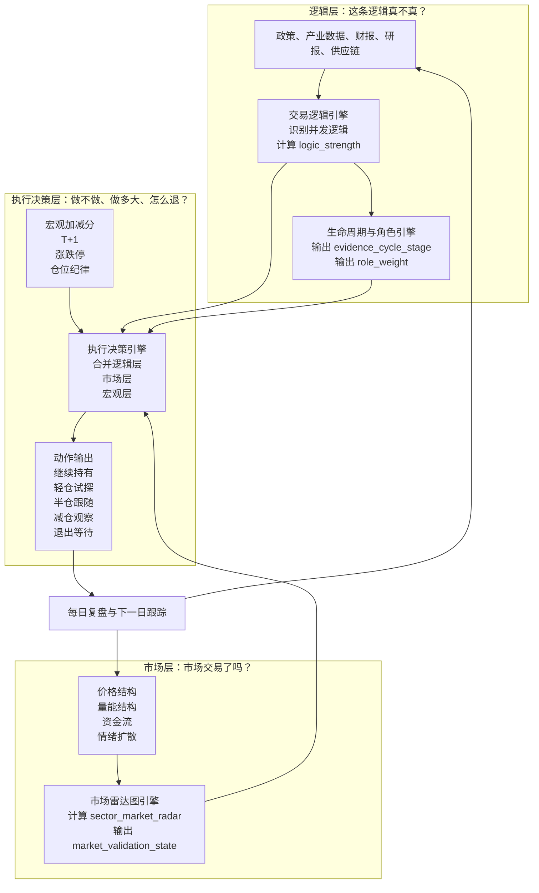

# 需求文档：交易逻辑驱动的智能选股系统

> **Version**: 5.0
> **Date**: 2026-04-18
> **Status**: DRAFT
> **Branch**: main

---

## 1. 系统定位

### 1.1 系统本质

这是一个**交易逻辑驱动的波段选股系统**。它不是纯认知工具，也不是单纯的技术指标筛选器，而是围绕以下问题设计的决策系统：

- 当前市场在交易什么。
- 这个逻辑还在不在。
- 逻辑是在强化、减弱，还是已经切换。
- 哪些股票最能承接这个逻辑。
- 当前继续持有是否还有依据。

### 1.2 核心使命

确保用户不受个股波动影响，能理性持仓或空仓，而不会情绪化交易。解决 A 股散户的三个核心痛点：

1. **错过入场** — 看到逻辑切换时已经大涨
2. **被噪音震出** — 分不清是逻辑反转还是量化噪音
3. **信息过载** — 新闻太多，无法提炼出驱动行情的主导逻辑

### 1.3 核心哲学：跟随不预测

系统基于当前可观测信号给出建议，**绝不做未来走势的点位预测**。

- ✅ "当前信号显示 XX，建议做 YY" — 观察-响应
- ✅ "strength declining，建议减仓" — 对当前状态的响应
- ❌ "预计将涨到 XX 价位" — 点位预测，系统不做
- ❌ "目标价 XX 元" — 点位预测，系统不做

### 1.4 交易风格

- **波段交易**：持仓天~周级别
- **不是** T+0/T+1 日内交易
- 扫描频率：**收盘后每日一次**

### 1.5 系统边界

| 本系统（选股系统） | 择时系统（另一个系统） |
|---|---|
| 选出股票 | 基于个股在不同板块的角色细化买卖时机 |
| 逻辑评分 + 市场雷达图 | 区分龙头/中军/跟风的入场时机 |
| 基础操作建议（方向/仓位/止损条件） | 具体买卖点判断 |
| 每日自动分析 top200 + 用户自选 | 盘中实时信号 |

---

## 2. 总体框架

### 2.1 决策闭环

本系统不是三个独立信号的拼凑，而是一条**因果关系链**。系统每天回答三个递进问题：



**因果顺序不可逆**：先有逻辑，市场才能交易这条逻辑；市场交易后，才能决定执行动作。反向操作——用价格倒推逻辑、用执行修改逻辑——都是不允许的。

### 2.2 三层判断总览

| 判断层 | 核心问题 | 允许输入 | 禁止输入 | 核心输出 |
|---|---|---|---|---|
| **逻辑层** | 这条逻辑是不是真的存在 | 研报、政策、产业数据、财报、订单、供需、竞争格局 | 价格涨跌、热度扩散、量价行为 | `logic_strength`、`role_weight`、`evidence_cycle_stage`、`sector_logic_score` |
| **市场层** | 市场有没有开始交易这条逻辑 | 价格结构、量能结构、资金承接、情绪扩散 | 政策真值、产业真值、未来收益回填 | `sector_market_radar`、`stock_market_radar`、`market_validation_state`、`sector_price_score`、`stock_price_score` |
| **执行决策层** | 现在该不该做、做多大、怎么退 | 逻辑层输出、市场层输出、宏观加减分、持仓约束、A 股执行约束 | 任何直接用未来收益修正当日动作的写法 | `operation_suggestion`、`position_level`、`veto_reason` |

### 2.3 这套框架的关键点

1. **先识别逻辑，再评价状态**
   - 先回答"市场在交易什么"，再用评分衡量这个逻辑是否值得跟。
2. **逻辑证据与市场确认必须隔离**
   - 逻辑是否成立，不能由当前价格本身倒推出；市场表现只影响执行与确认，不反向污染逻辑真值。
   - 概念上就不该让市场价格来定义逻辑所处阶段，生命周期标签只能来自证据体系。
3. **不是一次性判断，而是持续跟踪**
   - 每天更新逻辑强度、评分变化和风险信号。
4. **评分变化不是孤立事件**
   - 评分显著变化，往往意味着逻辑的强化、衰退或切换。
5. **允许多逻辑并发存在**
   - 一段行情可能由主逻辑、辅助逻辑和反向逻辑同时驱动，系统必须描述它们的主次关系和相互抵消关系。
6. **卖出不是靠感觉，而是靠失效条件**
   - 当逻辑被证伪、主导逻辑切换、或关键维度塌陷时，系统必须给出清晰解释。

### 2.4 信号架构

```
┌─────────────────────────────────────────────────────────────┐
│  宏观信号 (Macro Signal)                                     │
│  macro_thesis_score + sector_macro_adjustment                │
│  数据源：宏观经济指标、政策文件、全球市场                      │
└────────────────────┬────────────────────────────────────────┘
                     ▼
┌─────────────────────────────────────────────────────────────┐
│  板块信号 (Sector Signals)                                    │
│  ├─ sector_logic_score（纯逻辑推导）                           │
│  ├─ sector_fundamental_score（景气/盈利/估值）                  │
│  └─ sector_market_radar（3 维：技术/资金/情绪）                 │
└────────────────────┬────────────────────────────────────────┘
                     ▼
┌─────────────────────────────────────────────────────────────┐
│  个股信号 (Stock Signals)                                     │
│  ├─ stock_logic_score（板块逻辑 × 一致性 + 催化）               │
│  ├─ stock_fundamental_score（财务/护城河/管理）                 │
│  └─ stock_market_radar（3 维：技术/资金/情绪）                  │
└────────────────────┬────────────────────────────────────────┘
                     ▼
┌─────────────────────────────────────────────────────────────┐
│  综合决策 (Composite Decision)                                 │
│  宏观加减分 + 板块逻辑 + 板块市场雷达 + 个股逻辑 + 个股市场雷达    │
│  → 重点关注 / 观察名单 / 其余                                  │
└─────────────────────────────────────────────────────────────┘
```

### 2.5 隔离原则

- 逻辑评分只来自证据链，不引用价格、成交量、资金流、情绪
- 市场雷达图只来自市场行为，不引用政策、产业数据、财报
- 基本面评分只来自财务和产业数据，不引用价格行为
- 综合决策层组合以上信号，但不反向修改任何信号来源

### 2.6 逻辑行为与市场行为严格分离

| | 逻辑行为 | 市场行为 |
|---|---|---|
| **来源** | 政策、产业数据、供需、财报、研报 | 价格、成交量、资金流、情绪 |
| **回答** | 这个逻辑真不真 | 市场交易了这个逻辑没有 |
| **变化速度** | 相对缓慢，证据需要时间积累 | 可能很快，可能提前消化或延迟反应 |
| **因果关系** | 逻辑成立不一定市场立刻认可 | 市场认可不一定逻辑真的成立 |
| **在本系统中的角色** | 逻辑评分：驱动选股的核心依据 | 市场雷达图：辅助判断市场是否跟进了逻辑 |

**隔离红线**：逻辑评分不引用任何市场行为数据；市场雷达图不反向修改逻辑评分的任何字段。

---

## 3. 决策主线：为什么持有，为什么卖出

### 3.1 为什么持有

用户继续持有一只股票，必须同时满足决策闭环中的三个层面：

1. **逻辑层：这条逻辑还在不在**
   - 当前主导交易逻辑仍然成立。
   - `logic_strength` 稳定或上升。
   - 没有出现足以证伪该逻辑的关键信号。

2. **市场层：市场还在交易这条逻辑吗**
   - 市场雷达图技术面、资金面未持续恶化。
   - 价格行为没有持续背离逻辑方向。
   - 放量突破、趋势维持、资金承接等确认信号仍在。

3. **评分层：综合评分没有明显塌陷**
   - 板块和个股的逻辑评分没有明显塌陷。
   - 个股仍然能承接所属板块的主逻辑。

因此，系统给出"继续持有"的解释模板应是：

> 当前主导逻辑仍成立，逻辑强度未下降，板块和个股评分保持健康，市场尚未出现明确证伪信号，因此继续持有。

### 3.2 为什么卖出

用户卖出，不是因为"涨不动了"这么简单，而是因为决策闭环中任一类失效条件被触发：

1. **逻辑失效**（第一问的答案变了）
   - 旧逻辑被证伪。
   - 逻辑关键证据链断裂。
   - 新逻辑已接近或替代旧逻辑。

2. **评分塌陷**（综合评分支撑不住了）
   - 核心维度出现明显下滑，如逻辑评分、资金面、技术面同步走弱。
   - `sector_logic_score` 或 `stock_logic_score` 相对历史显著恶化。

3. **市场给出失效确认**（第二问的答案变了）
   - 价格连续背离逻辑方向。
   - 关键支撑失守且量能结构恶化。
   - 板块或个股进入风险排查清单，且风险信号持续强化。

系统给出"卖出/减仓"的解释模板应是：

> 不是因为短期波动，而是因为当前主导逻辑已被削弱或切换，同时关键评分维度显著下滑，市场也给出失效确认，因此应减仓或退出。

### 3.3 三类典型动作

| 动作 | 适用条件 | 系统解释 |
|---|---|---|
| **继续持有** | 逻辑未坏，市场仍在交易，评分健康 | 趋势仍在，逻辑仍成立 |
| **减仓/观察** | 逻辑未完全失效，但评分开始恶化或出现背离 | 先收缩风险，等待确认 |
| **卖出/切换** | 逻辑被证伪或新逻辑接管 | 原持仓理由已不成立 |

### 3.4 联动规则

| 观察到的变化 | 更可能意味着什么 | 建议动作 |
|---|---|---|
| 逻辑评分上升，市场雷达同步改善 | 逻辑强化 | 继续持有，等待回踩确认加仓 |
| 逻辑评分稳定，但技术/资金短期走弱 | 震荡或洗盘 | 观察，不急于否定逻辑 |
| 逻辑评分下降，逻辑面与市场雷达同步恶化 | 趋势后半段或逻辑衰退 | 减仓，缩短持有周期 |
| 次要逻辑快速抬头，主逻辑优势缩小 | 可能出现切换 | 重点跟踪，不再重仓旧逻辑 |
| 宏观层变差，板块逻辑仍强 | 风格压制将增强 | 保留强股，但降低容错 |
| 逻辑被证伪，市场也失效 | 原持仓理由消失 | 卖出或移出重点池 |

### 3.5 评分变化的三类含义

系统每天需要回答：今天的分数变化，究竟只是噪音，还是意味着逻辑层已经发生了变化？

| 变化类型 | 典型表现 | 解释 |
|---|---|---|
| **噪音变化** | 单日波动，次日恢复 | 不改变主逻辑 |
| **状态变化** | 连续数日缓慢恶化或改善 | 逻辑强弱在变化 |
| **逻辑变化** | 主导逻辑切换，关键证据反转 | 原持仓逻辑失效 |

---

## 4. 信号计算

### 4.1 宏观信号

#### 4.1.1 五个维度

| 维度 | 关键指标 | 作用 |
|---|---|---|
| **流动性环境** | M1-M2 剪刀差、Shibor 期限结构、社融增速 | 判断市场是否具备估值扩张基础 |
| **经济周期位置** | PMI 领先指数、库存周期、分行业景气度 | 判断增长动能和板块景气位置 |
| **通胀与成本** | PPI-CPI 剪刀差、PMI 价格指数 | 判断利润压力与成本拐点 |
| **政策方向** | 高层定调、部委政策、产业政策密度 | 判断政策支持或压制方向 |
| **全球联动** | Fed Rate、10Y Treasury、ISM PMI、关税风险、Polymarket | 判断外部流动性和风险偏好 |

**频率**：每周更新 + 重大事件触发立即重跑（Fed/PBOC 决策、Polymarket >20% 变化）。

#### 4.1.2 经济周期四象限

采用国内券商"货币-信用"框架：

| 象限 | 增长 | 流动性 | 名称 | 投资含义 |
|---|---|---|---|---|
| 一 | ↑ | ↑ | **宽信用期** | 增长+流动性双扩张，A 股表现最优 |
| 二 | ↑ | ↓ | **紧流动性期** | 盈利强但估值承压 |
| 三 | ↓ | ↓ | **双紧期** | 最不利阶段，防御为主 |
| 四 | ↓ | ↑ | **宽货币期** | 央行宽松对冲，布局窗口 |

**增长动能** = f(PMI 领先指数, 社融增速, 工业增加值)
**流动性动能** = f(M1-M2 剪刀差, Shibor 期限结构, DR007)

#### 4.1.3 宏观定位

- 宏观层是**加减分器，不是总闸门**
- `sector_macro_adjustment` 范围 `-0.10 ~ +0.10`
- 即使宏观一般，若板块逻辑极强仍可推荐，但仓位应更保守
- 即使宏观良好，若板块逻辑不成立，也不能因宏观加分而推荐

#### 4.1.4 宏观→板块映射

1. **板块敏感度配置表**：每个板块预定义对五个宏观维度的敏感度（-1.0 ~ +1.0）
2. **LLM 宏观解读**：每日生成受益/受损板块排序和拐点预警
3. **计算公式**：`sector_macro_adjustment = Σ(indicator_impact × indicator_sensitivity) / N`

#### 4.1.5 宏观信号输出

- `macro_thesis_score`（0-1）
- `macro_state`（四象限之一）
- `cycle_position`（{growth_momentum, liquidity_momentum, quadrant}）
- `macro_radar`（五个维度各 0-10）
- `leading_signals`（领先指标拐点预警列表）
- `trend_analysis`（各维度趋势 + 拐点时间戳）
- `sector_macro_adjustment`（板块差异化修正）

### 4.2 板块信号

#### 4.2.1 板块逻辑评分（sector_logic_score）

纯粹由逻辑证据推导，不引用市场行为。

**多逻辑并发模型**：一个板块可同时存在多条逻辑，每条逻辑有独立方向、角色和权重：

- `direction`：`positive`（正向推动）/ `negative`（反向压制）
- `role`：`primary`（主导）/ `secondary`（辅助）/ `headwind`（反向）
- `role_weight`：该逻辑在当前板块叙事中的主导份额
- `logic_strength`：该逻辑本身的证据强度（0-1）

**role_weight 计算（三套模板）**

先对 2 个核心证据维度逐项打分（0-5 分制），生成 `role_raw_score`，再在同方向内部归一化：

| 维度 | 含义 |
|---|---|
| **causal_centrality** | 是否解释了板块最核心的盈利/定价驱动 |
| **persistence** | 一次性冲击还是可持续的主线 |

| 逻辑族 | 公式 |
|---|---|
| **快**（事件驱动、制度变革） | `0.6*causal + 0.4*persistence` |
| **中**（政策驱动、流动性、估值重构） | `0.5*causal + 0.5*persistence` |
| **慢**（产业趋势、供需周期、成本反转、技术革命、竞争格局变化） | `0.4*causal + 0.6*persistence` |

归一化后得到 `role_weight`。若只有一条正向逻辑，则 `role_weight = 1`。

> 注：`coverage_breadth` 和 `irreplaceability` 暂不纳入，后续通过回测验证再决定是否扩展。

**sector_logic_score**：
```
sector_logic_score = Σ(each_logic.logic_strength × weight_by_status)
  dominant: weight = 0.6
  secondary: weight = 0.25
  其余: weight = 0.15 平分
```

**sector_logic_net_score**（净叙事推力）：
```
positive_core = Σ(positive_logic_strength × positive_role_weight)
negative_core = Σ(negative_logic_strength × negative_role_weight)
sector_logic_net_score = positive_core - negative_core
```
用途：`sector_logic_score` 衡量逻辑密度（个股匹配用），`sector_logic_net_score` 衡量净推力（跨板块排序用）。

**叙事信噪比（SNR）**：
```
SNR = 主导逻辑得分 / (次要逻辑得分总和 + 反向逻辑得分)
```

红线规则：
- `SNR < 1.5` → 强制状态 `混沌`，动作 `空仓观察`
- 解释："当前市场对这只票的看法过于分裂，逻辑博弈激烈，波段交易胜率不可控，建议回避"
- SNR 连续 3 日下降 → 标记"叙事模糊化"，进入减仓观察区

**逻辑定价饱和度（logic_pricing_saturation）**：

在 A 股市场，当逻辑能被公开信息捕捉时，价格往往已 Price In 大部分涨幅。逻辑评分创新高不等于能买。饱和度判定基于以下 4 个可观测信号：

| 信号 | 计算方式 | 含义 |
|---|---|---|
| 1. 逻辑证据充分 | `logic_strength > 0.7` | 逻辑已被充分验证 |
| 2. 边际价值衰减 | 近 5 日 `logic_strength` 加速度递减 | 证据还在增加，但增速在放缓 |
| 3. 市场已充分反应 | `sector_price_score > 7` | 价格已反映了逻辑 |
| 4. 周期进入后期 | `evidence_cycle_stage in [late, exhaustion]` | 逻辑叙事接近尾声 |

判定规则：
- 满足 3 项及以上 → `high`：否决新开仓，已持仓者继续持有
- 满足 2 项 → `medium`：降低一级仓位
- 满足 0-1 项 → `low`：正常

> 关键区分：新开仓看赔率，持有看逻辑真假。两套输出独立运行。

#### 4.2.2 板块基本面评分（sector_fundamental_score）

来源：板块成分股财务指标聚合 + 行业景气指数。
要素：盈利增速、估值分位、供需关系、产能利用率。
与市场行为无关。

#### 4.2.3 板块市场雷达图（sector_market_radar）

3 维市场行为，独立于逻辑评分和基本面评分。三维数据源必须互斥，禁止同源循环论证：

| 维度 | 禁止使用的数据（会导致循环） | 推荐使用的低相关数据 | 数据来源 |
|---|---|---|---|
| **技术面** | 单纯收盘价趋势 | ATR 收缩/扩张率、板块内成分股涨跌离散度（龙头涨跟风不涨=结构差） | K 线、板块内个股数据 |
| **资金面** | 当日主力净流入（本质是成交额派生） | 筹码密集区位移（获利筹码比例变化）、北向持仓变动 | 资金流向数据 |
| **情绪面** | 收盘后的新闻标题情感分析 | 搜索指数变化率（提前于新闻）、淘股吧/雪球讨论热度变化（只看讨论量） | 搜索指数、社区数据 |

输出：`sector_market_radar`（3 维各 0-10）、`sector_price_score`（0-1，技术面+资金面综合）

**板块/个股市场雷达交叉验证**：

| 板块雷达 | 个股雷达 | 含义 | 动作 |
|---|---|---|---|
| 强 | 强 | 板块龙头，逻辑+市场共振 | 重点推荐 |
| 强 | 弱 | 板块内弱势股，资金不认可 | 跳过，找龙头 |
| 弱 | 强 | 个股独立行情，非板块驱动 | 独立观察，不纳入板块框架 |
| 弱 | 弱 | 无人交易 | 不参与 |

#### 4.2.4 市场确认状态机

市场雷达图是连续的（用户看到的），但系统决策需要离散状态。状态由雷达图三维度阈值组合推导，不是独立打分：

| 状态 | 含义 | 判定条件 | 可执行动作 |
|---|---|---|---|
| **unrecognized** | 市场还没注意到这条逻辑 | 技术面 < 5 且 资金面 < 5 | 仅观察，不可介入 |
| **validating** | 开始有资金跟进但犹豫 | 任一维度 ≥ 6 但未形成共振 | 轻仓试探 |
| **confirmed** | 趋势确立，市场共识形成 | 技术面 ≥ 7 且 资金面 ≥ 6 且 情绪面 ≥ 5 | 可以加仓 |
| **crowded** | 过度拥挤，风险溢价极高 | 情绪面 ≥ 8 但技术面开始掉头（量价背离） | 减仓观察 |
| **invalidated** | 价格持续背离逻辑方向 | 技术面 < 5 且 资金连续流出 | 退出 |

**状态转换规则**：
- 状态转换需要连续 2 日确认，避免单日噪音误判
- `confirmed → crowded` 的转换比 `unrecognized → validating` 更快（1 日即可），因为拥挤是风险信号

#### 4.2.5 逻辑翻转监控

**持续监控**（每日运行，不产生事件）：
- 计算 `logic_strength` 和 `role_weight` 变化量
- 输出预警标志：`"正常"` / `"接近翻转"`

**翻转确认**（监控信号持续 N 日后触发）：
- 快逻辑：3 日
- 中逻辑：5 日
- 慢逻辑：10 日

触发条件（满足任一）：
- 当前 dominant `logic_strength` < 0.3
- 新逻辑 `logic_strength` > dominant × 0.8
- 关键证据链断裂
- `role_weight` 连续重分配

#### 4.2.6 板块信号输出汇总

- `sector_logic_score`（纯逻辑）
- `sector_logic_net_score`（净推力）
- `sector_fundamental_score`（基本面）
- `sector_market_radar`（3 维市场行为）
- `sector_price_score`（市场行为综合）
- `market_validation_state`（市场确认状态：5 级）
- `sector_dominant_logic_id`
- `sector_active_logics`
- `sector_logic_change_detected`
- `logic_pricing_saturation`（低/中/高）
- `sector_macro_adjustment`
- `issue_queue`
- `snr`（叙事信噪比）

### 4.3 个股信号

#### 4.3.1 个股池

- 每日成交额 top200 + 用户自选（成交额取近 5 日平均）
- 排除 ST、*ST、长期停牌个股
- 不做前置过滤

#### 4.3.2 个股与板块关系

- 个股取所属板块中 `sector_logic_score` 最高的作为逻辑归属
- 个股逻辑面 = `sector_logic_score × 一致性系数(0-1) + 个股催化剂加分`
- 个股行为不反向影响板块信号

#### 4.3.3 个股逻辑评分（stock_logic_score）

来源：板块逻辑评分 × 个股与逻辑的一致性 + 个股自身催化事件。
纯粹由逻辑匹配推导，不引用市场行为。

#### 4.3.4 个股基本面评分（stock_fundamental_score）

来源：PE/PB/ROE/营收增速/现金流 + 护城河类型/趋势 + 管理质量。
与市场行为无关。

#### 4.3.5 个股市场雷达图（stock_market_radar）

3 维市场行为，独立于逻辑评分和基本面评分：

| 维度 | 含义 | 数据来源 |
|---|---|---|
| **技术面** | 趋势、量价、支撑阻力、动量 | 个股 K 线 |
| **资金面** | 主力资金、北向、融资融券 | 个股资金流向 |
| **情绪面** | FinBERT 情绪 + 新闻热度 | 个股新闻 + 搜索指数 |

输出：`stock_market_radar`（3 维各 0-10）、`stock_price_score`（0-1，技术面+资金面综合）

#### 4.3.6 个股信号输出汇总

- `stock_logic_score`（纯逻辑）
- `stock_fundamental_score`（基本面）
- `stock_market_radar`（3 维市场行为）
- `stock_price_score`（市场行为综合）
- `market_validation_state`（市场确认状态：5 级）
- `operation_suggestion`
- `stock_recommend_score`
- `logic_pricing_saturation`（低/中/高）

### 4.4 综合决策层

#### 4.4.1 逻辑×市场×宏观决策矩阵

| 逻辑 | 市场 | 宏观 | 含义 | 动作 |
|---|---|---|---|---|
| 强 | 强 | 正 | 最佳组合 | 重仓，持有 |
| 强 | 强 | 负 | 逻辑对、市场跟了，但大环境差 | 持有，不加仓 |
| 强 | 弱 | 正 | 逻辑对但市场没跟上 | 观察，等确认 |
| 强 | 弱 | 负 | 逻辑对但没人买，大环境也差 | 仅观察 |
| 弱 | 强 | 正 | 市场在交易但逻辑不清 | 跳过 |
| 弱 | 强 | 负 | 纯炒作 | 跳过 |
| 弱 | 弱 | 正 | 什么都没发生 | 不参与 |
| 弱 | 弱 | 负 | 最差组合 | 不参与 |

#### 4.4.2 逻辑族专属执行模板

```
# 快逻辑
entry_readiness = 0.20 * stock_logic + 0.15 * sector_logic_net + 0.25 * stock_price + 0.25 * sector_price + 0.15 * macro_adj

# 中逻辑
entry_readiness = 0.30 * stock_logic + 0.25 * sector_logic_net + 0.20 * stock_price + 0.15 * sector_price + 0.10 * macro_adj

# 慢逻辑
entry_readiness = 0.35 * stock_logic + 0.30 * sector_logic_net + 0.10 * stock_price + 0.10 * sector_price + 0.15 * macro_adj
```

快逻辑更依赖市场确认，慢逻辑更依赖逻辑真值。`stock_recommend_score` 仅用于展示排序。

**entry_readiness → position_level 映射**：

| entry_readiness | 快逻辑仓位 | 中逻辑仓位 | 慢逻辑仓位 |
|---|---|---|---|
| < 0.3 | no_trade | no_trade | no_trade |
| 0.3-0.5 | watch | watch | watch |
| 0.5-0.65 | probe_small | probe_small | probe_small |
| 0.65-0.8 | follow_half | hold | hold |
| > 0.8 | hold | hold | hold |

**价格衰减因子**：按逻辑族差异化，在执行层对推荐结果打折：

| 逻辑族 | 衰减均线 | 衰减起点 | 最低折扣 |
|---|---|---|---|
| 快 | MA30 | 偏离均线 >30% | 0.2 |
| 中 | MA120 | 偏离均线 >40% | 0.3 |
| 慢 | MA200 | 偏离均线 >50% | 0.4 |

计算方式：
```
adjusted_entry_readiness = entry_readiness × price_discount
price_discount = max(最低折扣, 1 - (current_price / MA - 1))
```

> 不在逻辑层引入价格，仅在综合决策执行层做性价比调整。

#### 4.4.3 T+1 隔夜风险检查

在输出 `operation_suggestion` 前强制运行：

**检查 1：获利盘厚度**
- 过去 5 日板块/个股累计涨幅 >15%？
- → 是：否决当日追涨建议，改为"等待回踩，观察 X 日均线支撑"
- → 否：通过

**检查 2：逻辑兑现时间差**
- 信号源是"昨日晚间新闻"？
- → 是：禁止建议"开盘买入"，改为"观察开盘后 30 分钟承接力度"
- → 否（盘中突发或连续验证多日）：通过

**检查 3：涨跌停约束**
- 昨日涨停？
- → 是：建议"等待首次分歧日，不追连续涨停"
- → 否：通过

**快逻辑额外约束**：T+1 环境下，快逻辑的 `market_validation_state` 至少 `confirmed` 才能推荐进入（不能只到 `validating`）。

任一检查未通过 → 降低一级仓位，附加等待条件。

#### 4.4.4 持有决策矩阵

每日收盘后自动运行，区别于进入决策：

```
今日持有检视：
├─ 逻辑还在不在？
│   ├─ logic_strength 连续下降？ → 标记"逻辑衰减"
│   └─ 关键证据链断裂？ → 标记"逻辑失效"（立即退出）
├─ 市场还在不在？
│   ├─ market_validation_state 降级？ → 标记"市场退出"
│   └─ 价格持续背离逻辑方向？ → 标记"市场证伪"（立即退出）
├─ 赔率还在不在？
│   └─ evidence_cycle_stage 进入 late/exhaustion？ → 标记"赔率恶化"
└─ 约束还在不在？
    └─ 明日有重大事件风险？ → 标记"事件风险"

输出：
- 全部通过 → 继续持有
- 1 项标记 → 减仓观察
- 2 项及以上 → 退出
- 逻辑失效/市场证伪 → 立即退出
```

#### 4.4.5 执行否决规则

1. **逻辑层否决**：`logic_strength` 跌破模板下限，或关键证据链断裂，或 `SNR < 1.5`（混沌状态）
2. **市场层否决**：市场雷达图技术面、资金面、情绪面同步恶化，持续超限
3. **约束层否决**：T+1、涨跌停、停牌、仓位上限使动作不可执行
4. **赔率否决**：`logic_pricing_saturation = high` 且 `evidence_cycle_stage = late` → 否决新开仓

否决时必须给出人话解释。

#### 4.4.6 分层展示

| 层级 | 条件 |
|---|---|
| **重点关注** | 推荐分数高，市场雷达图三维度无明显短板（最低维度 ≥ 5） |
| **观察名单** | 逻辑有吸引力，但尚未完全确认或存在单一短板 |
| **其余** | 当前不应投入主要注意力 |

#### 4.4.7 操作建议

- 格式：方向（看多/看空/观望）+ 仓位（轻仓/半仓/重仓）+ 止损条件（定性描述）+ 等待条件（如适用）
- 示例："看多，轻仓试探，若关键支撑区域失守或量能连续萎缩则离场"
- 示例："看多但需等待，开盘后 30 分钟观察承接力度再决定是否介入"
- **明确不做**：不给具体入场价位、目标价、止损价

---

## 5. 逻辑生命周期

### 5.1 七个阶段

```
发现逻辑 → 建立证据链 → 追踪强度 → 判断周期位置 → 监控市场确认 → 确认主次切换 → 输出动作
```

### 5.2 各阶段定义

| 阶段 | 核心任务 | 禁止 |
|---|---|---|
| **发现** | 识别板块主导叙事 | 禁止用价格涨跌作为逻辑成立证据 |
| **建立证据链** | 自动生成评估维度，高+中可信度交叉验证 | — |
| **追踪强度** | 每日更新 `logic_strength` 和趋势 | 禁止混入价格、成交量、资金流 |
| **判断周期** | `early / mid / late / exhaustion`，基于证据渗透率/产业扩散度/研究共识/反向约束 | 禁止用涨跌幅定义周期 |
| **监控确认** | 通过市场雷达图判断市场是否已交易该逻辑 | 不能反向修改逻辑评分 |
| **确认切换** | 翻转监控持续 N 日后触发 → 生成 `LogicFlipEvent` | — |
| **输出动作** | `持有/轻仓/半仓/减仓/退出` | — |

### 5.3 卖出/退出逻辑

| 失效类型 | 触发条件 | 系统解释 |
|---|---|---|
| **逻辑失效** | 旧逻辑被证伪 / 证据链断裂 / 新逻辑接近替代 | 原持仓理由已不成立 |
| **评分塌陷** | 逻辑评分 + 市场雷达图同步走弱 | 持仓理由变弱，不是简单波动 |
| **市场证伪** | 市场雷达图持续背离逻辑方向 / 关键支撑失守且量能恶化 | 市场已否定该逻辑 |
| **赔率恶化** | 逻辑已充分定价，性价比不足 | 逻辑还在但赔率不够，不建议新开仓 |

系统提示失效信号，不给出具体卖出价位。

---

## 6. 逻辑类型与风险模板

### 6.1 逻辑类型全集

| 逻辑类型 | 逻辑族 | 典型持续时间 |
|---|---|---|
| 产业趋势 | 慢 | 数月至数年 |
| 政策驱动 | 中 | 数周至数月 |
| 供需周期 | 慢 | 数月至季度 |
| 流动性 | 中 | 数周至数月 |
| 事件驱动 | 快 | 数日至 2 周 |
| 估值重构 | 中 | 数周至数月 |
| 成本反转 | 慢 | 数月至季度 |
| 技术革命 | 慢 | 数月至数年 |
| 竞争格局变化 | 慢 | 数月 |
| 制度变革 | 快 | 数周至数月 |

### 6.2 风险模板

每种逻辑类型绑定一套风险模板，服务于：发现逻辑变弱、加入排查清单、触发切换检测。

### 6.3 模板治理

状态：`candidate → shadow_live → live → degraded → retired`。慢逻辑额外要求覆盖 2 个不同市场风格期、2 个宏观流动性阶段、2 个产业兑现阶段。

---

## 7. 输出格式

### 7.1 个股卡片必须回答

1. 当前所属最强板块是什么
2. 当前主导交易逻辑是什么
3. 这条逻辑在增强、稳定还是走弱
4. 板块和个股评分相对近期的变化
5. 为什么继续持有，或为什么只能观察
6. 如果退出，应当由什么失效条件触发

### 7.2 推荐语模板

| 动作 | 模板 |
|---|---|
| 持有 | "当前板块主逻辑仍成立，逻辑强度稳中有升，个股与板块逻辑一致性高，市场雷达图未出现失效信号" |
| 等待 | "逻辑方向正确，但市场确认不足。当前更适合观察技术确认" |
| 等待（隔夜风险） | "逻辑成立，但获利盘较厚，建议等待回踩后介入，避免追高" |
| 等待（逻辑兑现） | "信号源来自晚间新闻，建议观察开盘后 30 分钟承接力度再决定是否介入" |
| 减仓 | "旧逻辑尚未完全失效，但逻辑强度和市场雷达图开始走弱" |
| 退出 | "原始逻辑已被削弱或切换，市场也出现失效确认，原持仓理由不再成立" |
| 混沌 | "当前市场对这只票的看法过于分裂，逻辑博弈激烈，波段交易胜率不可控，建议回避" |
| 逻辑已充分定价 | "逻辑本身未被破坏，但市场已充分反映，赔率不足，不建议新开仓" |

---

## 8. 数据模型

### 8.1 TradingLogic

```json
{
  "sector": "CPO/光通信模块",
  "sector_code": "880792",
  "logic_id": "logic_2026_04_cpo_ai_demand",
  "title": "AI算力基础设施需求爆发",
  "description": "海外云厂商资本开支持续高增长，CPO作为光通信核心环节直接受益",
  "category": "产业趋势",
  "logic_family": "slow",
  "direction": "positive",
  "role": "primary",
  "role_weight": 0.65,
  "identified_date": "2026-03-15",
  "logic_strength": 0.72,
  "logic_strength_framework": {
    "logic_type": "产业趋势",
    "dimensions": [
      {"name": "causal_centrality", "score": 8},
      {"name": "persistence", "score": 7}
    ]
  },
  "logic_strength_trend": "increasing",
  "evidence_cycle_stage": "mid",
  "evidence_sources": [
    {"source": "research_report_456", "weight": 0.4, "summary": "AI算力链景气度分析", "credibility": "high"},
    {"source": "supply_chain_signal", "weight": 0.3, "summary": "中际旭创订单排满至Q3", "credibility": "medium"}
  ],
  "status": "dominant"
}
```

### 8.2 SectorSignals

```json
{
  "sector": "CPO/光通信模块",
  "sector_code": "880792",
  "date": "2026-04-14",
  "sector_logic_score": 0.68,
  "sector_logic_net_score": 0.52,
  "sector_fundamental_score": 0.70,
  "sector_market_radar": {
    "technical": 7.0,
    "capital_flow": 6.8,
    "sentiment": 7.2
  },
  "sector_price_score": 0.68,
  "market_validation_state": "confirmed",
  "sector_dominant_logic_id": "logic_2026_04_cpo_ai_demand",
  "sector_active_logics": [
    {
      "logic_id": "logic_2026_04_cpo_ai_demand",
      "logic_strength": 0.72,
      "direction": "positive",
      "role": "primary",
      "role_weight": 0.65,
      "status": "dominant",
      "weight": 0.6
    }
  ],
  "sector_logic_change_detected": false,
  "logic_pricing_saturation": "low",
  "sector_macro_adjustment": 0.15,
  "issue_queue": [],
  "snr": 3.2
}
```

### 8.3 StockSignals

```json
{
  "stock_code": "300502",
  "stock_name": "新易盛",
  "date": "2026-04-14",
  "stock_logic_score": 0.80,
  "stock_fundamental_score": 0.75,
  "stock_market_radar": {
    "technical": 7.2,
    "capital_flow": 8.0,
    "sentiment": 7.6
  },
  "stock_price_score": 0.75,
  "market_validation_state": "confirmed",
  "operation_suggestion": {
    "direction": "看多",
    "position": "轻仓",
    "stop_condition": "若关键支撑区域失守或量能连续萎缩则离场"
  },
  "tier": "重点关注",
  "sector_code": "880792",
  "sector_logic_score_ref": 0.68,
  "stock_recommend_score": 0.78,
  "logic_family": "slow",
  "logic_pricing_saturation": "low"
}
```

### 8.4 MacroContext

```json
{
  "date": "2026-04-14",
  "macro_thesis_score": 0.72,
  "macro_state": "宽信用期",
  "cycle_position": {
    "growth_momentum": 0.6,
    "liquidity_momentum": 0.4,
    "quadrant": "宽信用期"
  },
  "macro_radar": {
    "liquidity_environment": 7.5,
    "economic_cycle_position": 6.8,
    "inflation_and_cost": 5.2,
    "policy_direction": 7.0,
    "global_linkage": 6.5
  },
  "leading_signals": [
    {
      "indicator": "M1-M2 剪刀差",
      "current_value": -3.5,
      "trend": "收窄",
      "duration_months": 3,
      "prediction": "预示 2-3 月后流动性收紧",
      "confidence": 0.75
    }
  ],
  "trend_analysis": {
    "liquidity_environment": {
      "trend": "declining",
      "momentum": -0.15,
      "inflection_point": "2026-02-15"
    }
  },
  "derived_indicators": {
    "m1_m2_scissors": {"current": -3.5, "prev_month": -2.8, "trend": "收窄"},
    "ppi_cpi_scissors": {"current": 1.8, "prev_month": 2.1, "trend": "收窄"}
  }
}
```

### 8.5 LogicFlipEvent

```json
{
  "sector": "光伏",
  "flip_type": "dominant_change",
  "old_dominant": "成本>收益亏损逻辑",
  "new_dominant": "政策补贴+困境反转逻辑",
  "confidence": 0.78,
  "trigger_signals": [
    "政府发布2026年光伏补贴细则",
    "行业龙头成本跌破关键心理价位后快速回升"
  ],
  "detected_at": "2026-04-12",
  "action_hint": {
    "suggestion": "新逻辑已确认，建议关注板块内契合度高的个股",
    "invalidation": "若板块逻辑评分持续走弱，新逻辑可能被证伪"
  }
}
```

### 8.6 数据质量处理

- **矛盾数据**：标记 `logic_strength = MIN(logic_strength, 0.4)`，等待第三源确认
- **证据分层**：官方文件/券商报告 > 主流财经媒体 > 自媒体/论坛 > 匿名
- **AI 合成失败**：降级为 `status = "unknown"`，提示"不建议盲目交易"

---

## 9. 中军与基本面

### 9.1 中军定义

**中军 = 行业龙头**，由研报/研究确认（非市值排名）。Phase 1 手动标记，Phase 2 AI 通过研报分析识别。中军切换由择时系统处理，本系统仅使用当前中军信息。

### 9.2 基本面分析

- **结构化数据**：PE/PB/ROE/营收增速/现金流
- **AI 读研报**：行业地位、竞争格局、技术壁垒、成长预期
- **Buffett 定性补充**：五类护城河 + 管理质量，作为快速否决信号和定性标签

---

## 10. A 股微结构约束

| 约束 | 影响 |
|---|---|
| T+1 | 操作建议必须考虑隔日风险，快逻辑需更高市场确认门槛 |
| 涨跌停 | 主板 ±10%，创业板/科创板 ±20% |
| 集合竞价 | 9:15-9:25 信号价值高，但不可执行 |
| 停牌 | 停牌期间无法交易，逻辑变更事后确认 |

---

## 11. LLM 合成引擎

### 11.1 验证与回退

1. **Schema validation**：解析失败 → 重试 → 仍失败 → `status = "unknown"`
2. **Evidence check**：零证据源 → 降级
3. **Cross-run consistency**：衡量 AI 稳定性，映射到 `confidence`
4. **Manual override**：用户可覆盖任何 AI 生成逻辑
5. **Fallback chain**：LLM 失败 → 重试 → 仍失败 → `status = "unknown"`

### 11.2 字段归属

| 字段 | 归属 |
|---|---|
| `logic_strength` | 逻辑评分 |
| `role_weight` | 逻辑评分 |
| `evidence_cycle_stage` | 逻辑评分 |
| `sector_logic_score` | 逻辑评分 |
| `sector_logic_net_score` | 逻辑评分 |
| `sector_market_radar` | 市场雷达图 |
| `stock_logic_score` | 逻辑评分 |
| `stock_market_radar` | 市场雷达图 |
| `market_validation_state` | 市场雷达图 |
| `logic_pricing_saturation` | 执行决策层 |
| `snr` | 执行决策层 |
| `stock_recommend_score` | 综合决策层 |
| `operation_suggestion` | 综合决策层 |
| `position_level` | 综合决策层 |
| `veto_reason` | 综合决策层 |

---

## 12. NOT in scope

- **择时系统**：龙头/中军/跟风的买卖时机 — 另一系统
- **日内交易**：T+0/T+1 盘中实时信号
- **具体价位预测**：入场价、目标价、止损价
- **港股/美股**：当前仅 A 股
- **盘中实时扫描**：收盘后每日一次
- **Kronos 预测**：作为独立参考视图，不影响操作建议

---

## 13. 风险与缓解

| 风险 | 可能性 | 影响 | 缓解措施 |
|---|---|---|---|
| LLM 幻觉 | 高 | 高 | 必须引用具体证据源。Schema 验证 |
| 翻转信号过于自信 | 中 | 高 | 持续 N 日确认后触发。左侧标记为"信号确认中" |
| 数据管线脆弱 | 高 | 中 | 采集器独立容错 |
| 黑天鹅事件 | 低 | 高 | confidence < 0.3 → `unknown regime` |
| 中文数据采集不稳定 | 高 | 高 | 多数据源 fallback |
| 逻辑评分与市场雷达同源 | 高 | 高 | 强制互斥数据源定义，禁止循环论证 |
| 研报密集发布导致逻辑评分虚高 | 中 | 高 | 逻辑定价饱和度检查，边际价值衰减判定 |
| 多逻辑并发导致系统永不认错 | 中 | 高 | SNR < 1.5 强制混沌状态，空仓观察 |

---

## 14. 待决事项

| # | 事项 | 优先级 |
|---|---|---|
| T1 | 中文数据采集可行性 PoC | P0 |
| T2 | 财报数据获取渠道确认 | P0 |
| T3 | 研报数据获取渠道确认 | P0 |
| T4 | 筹码密集区位移数据获取渠道确认 | P0 |
| D1 | 各逻辑类型的评估维度模板 | 待实现 |
| D2 | 市场雷达图各维度具体子指标和评分规则 | 待实现 |
| D3 | 操作建议的 LLM prompt 模板 | 待实现 |
| D4 | 推荐结果的 UI/UX 设计 | 待实现 |

---

## 15. 版本历史

| 版本 | 日期 | 变更 |
|---|---|---|
| 3.0 | 2026-04-18 | 逻辑/市场行为彻底解耦重构 |
| 4.0 | 2026-04-18 | 补充决策闭环心法，新增第 3 节"决策主线" |
| 5.0 | 2026-04-18 | 全面深化：市场层/执行层/三者关系 |
| | | 1. 新增市场确认状态机（5 状态，由雷达图阈值推导） |
| | | 2. 新增逻辑×市场×宏观 8 种决策矩阵 |
| | | 3. 新增市场雷达图三维互斥数据源定义 |
| | | 4. 新增板块/个股市场雷达交叉验证 |
| | | 5. 新增逻辑定价饱和度（4 信号判定） |
| | | 6. 新增叙事信噪比 SNR，SNR < 1.5 强制混沌状态 |
| | | 7. 新增 entry_readiness → position_level 映射表 |
| | | 8. 新增持有决策矩阵（区别于进入决策） |
| | | 9. 新增 T+1 隔夜风险检查（3 项检查） |
| | | 10. 新增价格衰减因子（按逻辑族差异化均线基准） |
| | | 11. role_weight 简化为两维（causal_centrality + persistence） |
| | | 12. 新增逻辑兑现时间差检查（晚间新闻→等开盘 30 分钟） |
